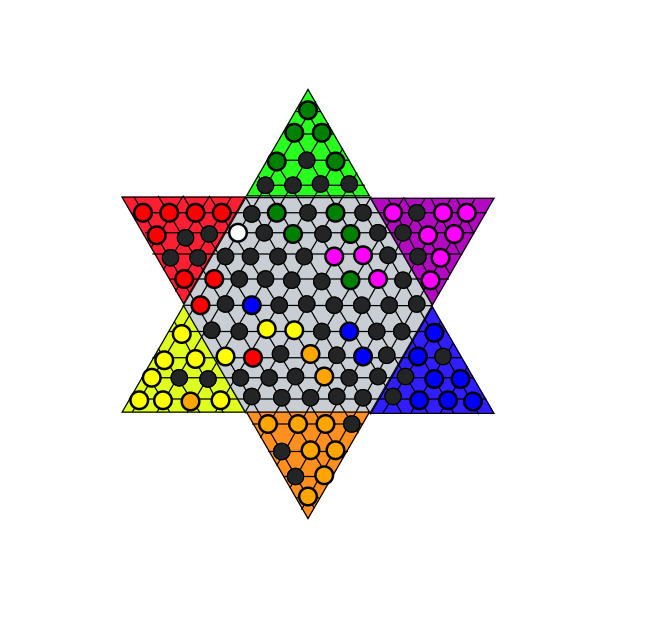

# Halma-JavaFx

PRAVIDLÁ HRY

Halma alebo čínske dáma je hra pre 2 až 6 hráčov.
Cieľom je premiestniť všetky svoje kamene do cieľového rohu v opačnej časti hracej plochy skôr, ako to urobia súperi.
Tento cieľový roh sa nazýva "domov".
Postup hry:
Hráči sa striedajú v ťahoch, pričom v jednom ťahu môžu:
Presunúť jeden kameň o jedno políčko v ľubovoľnom smere na susedné voľné miesto,
Preskakovať cez jeden alebo viac vlastných alebo súperových kameňov v jednom alebo viacerých po sebe idúcich skokoch.

Dôležité obmedzenie:
Hráč nemôže kombinovať skok a jednoduchý krok v jednom ťahu – každý ťah pozostáva len z jedného typu pohybu (buď len posun, alebo len skoky)

GAME IMPLEMENTATION
1. Class Hole
Reprezentuje jedno pole (jamku) na hracej doske.
Uchováva:
Circle – grafický prvok JavaFX.
Koordináty v kubickom formáte (x, y, z).
Stav poľa (FREE alebo OCCUPIED).
Zoznam susedných polí.
Reaguje na kliknutia myšou: ak je pole voľné, umožní presun vybranej figúrky.

2. Class Piece
Reprezentuje hernú figúrku.
Dedi Circle, takže sa priamo vykresľuje na doske.
Uchováva:
Farbu hráča.
Aktuálne pole (Hole), na ktorom stojí.
Poskytuje logiku pohybu:
Bežné ťahy do voľných susedných polí.
Skoky cez obsadené polia (rekurzívne).
Reaguje na kliknutia: výber/odznačenie figúrky, zvýraznenie.
Kontroluje podmienky víťazstva po presune.

3. Class BoardController
Hlavný kontrolér hracej dosky.
Zodpovedá za:
Inicializáciu hry (initialize()).
Vytvorenie polí z FXML (createHole()).
Načítanie počiatočných pozícií z Coord.chc (startBoard()).
Vytváranie figúrok (createPiece()).
Správu poradia ťahov (turnOrder, switchTurn()).
Kontrolu víťazstva (checkWinner()).
Resetovanie zvýraznenia (resetColorAllGroup, resetColorHoles).

Screen of gameplay:

   

   
Biela figúrka je tá figúrka, ktorá bola vybraná a bude sa pohybovať.

Kľúčové koncepty

Kubické koordináty: používajú sa na hexagonálnu mriežku pre výpočet susedov.
Každý kruh v súbore Board.fxml má svoje vlastné ID, ktoré sa zhoduje s jeho súradnicami. V súbore Coord.chc
sú súradnice kruhov každého tímu, ktoré potom slúžia ako základ pre implementáciu hernej logiky.

Base Camps: počiatočné a cieľové zóny pre každý tím.

FXML: Vizualizácia hernej dosky.

Zhrnutie
Implementácia spája JavaFX UI (Circle, AnchorPane, Group) s hernou logikou (Hole, Piece, BoardController). 
Výsledkom je plne hrateľná verzia Halma s pravidlami pohybu, skokmi, správou ťahov a kontrolou víťazstva.

